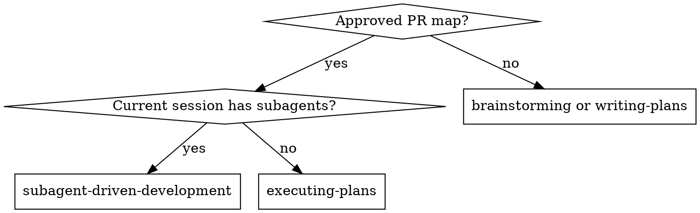

# Subagent-Driven Development

Execute an implementation plan one pull request at a time. Use focused implementation subagents for tasks, then review the complete PR for spec compliance, code quality, and test coverage. Task completion is not a review gate.

**Core principle:** fresh implementer context per task, one whole-PR review, persistent PR feedback handling, and a merge gate before dependent work.

**Why subagents:** Construct each implementer's context deliberately. Give it only the PR entry, task brief, contracts, constraints, report path, and relevant repository instructions; do not rely on controller conversation history. This keeps tasks focused and preserves controller context for coordination.

**Narration:** Between tool calls, narrate at most one short line. The progress ledger, reports, and review packages are the durable record.

**Continuous execution:** Do not stop for routine task-by-task check-ins. Continue through the current PR unless an implementer is `BLOCKED`, the plan is ambiguous, verification fails repeatedly, a required permission is missing, or the current PR reaches its merge/provisioning gate.

## When to Use

Use when an approved implementation plan has a PR map and the work can be executed in the current session with subagent support. Use `executing-plans` when execution belongs in a separate session or subagents are unavailable.



Use `executing-plans` for a separate or subagent-less session. Both workflows execute one PR at a time; only this skill delegates focused task implementation.

## Pre-Flight Plan Review

Before dispatching the first task of a PR, scan the spec, implementation plan, test plan, and PR entry for conflicts:

- Tasks that contradict the PR entry, global constraints, or explicit non-goals.
- Requirements that cannot be independently tested at this PR boundary.
- Plan instructions that mandate behavior the review rubric would reject, such as assertions that prove nothing or duplicated logic without a compatibility reason.
- Missing prerequisite contracts, migrations, fixtures, or rollback constraints.

If the scan finds a material conflict, ask one batched question that cites both sides before implementation. If it is clean, record that result in the ledger and proceed. Do not rediscover the same plan conflict independently in every task.

## Process

```text
Load implementation plan and test plan
  → read PR map and create PR-level ledger
  → for each PR in dependency order:
       set up isolated branch/worktree
       dispatch one implementer subagent per task
       process implementer status, preserve task evidence, and record task progress
       do not dispatch a task reviewer or task-level review package
       run the PR test matrix
       open/update PR with spec/plan/test-plan links
       dispatch whole-PR reviewer
       start persistent PR feedback loop
       wait for checks, reactions, reviews, and resolved threads
       squash-merge without deleting branch/worktree unless cloud secret/variable provisioning is required
  → start the next dependent PR only after merge
  → run final E2E/release PR last when the test plan defers it
```

Before starting, inspect `.superplex/sdd/progress.md` and the PR review ledger. Completed PRs and tasks recorded there must not be re-dispatched.

## PR-Level Review Rule

Do not dispatch a code-quality or spec-compliance review after each task. Tasks are implementation units within a PR. After all tasks in the current PR are complete:

1. Generate the complete PR diff package.
2. Run the PR-specific test matrix and required verification.
3. Open or update the PR with these exact links in the body:
   - Approved spec.
   - Implementation plan.
   - Test plan, or the explicit reason there is none.
4. Dispatch the whole-PR reviewer using `../requesting-code-review/code-reviewer.md`.
5. Require separate spec-compliance, code-quality, and test-coverage verdicts.
6. Start `../receiving-code-review/pr-feedback-agent.md` for all remote feedback and merge monitoring.
7. Do not start a dependent PR until this PR's merge gate passes.

After each task, process the implementer's status, append its commits/tests/report to the ledger, and continue to the next task when it is `DONE`. The historical `task-reviewer-prompt.md` path is not invoked at task boundaries; it is retained only as a PR-reviewer compatibility template. Generate one review package and dispatch one reviewer only after every task in the PR is complete.

## Dispatching Implementers

Use `implementer-prompt.md`. Give each implementer a task brief file, the PR's scene-setting context, earlier PR contracts, exact constraints, and a report path. Each implementer must:

- Follow TDD: write a failing test, verify RED, implement minimally, verify GREEN, then refactor.
- Work only within the task and PR ownership boundaries.
- Commit its work and self-review before reporting.
- Report `DONE`, `DONE_WITH_CONCERNS`, `NEEDS_CONTEXT`, or `BLOCKED`.
- Re-run the tests covering any review fix and record the output in its report.

**REQUIRED SUB-SKILL:** Implementers use `superplex:test-driven-development` for feature and bug-fix work. Their report contains RED and GREEN evidence when TDD applies.

### Implementer Status Protocol

| Status | Controller action |
| --- | --- |
| `DONE` | Record commits and focused verification. Continue to the next task; do not dispatch a task reviewer. |
| `DONE_WITH_CONCERNS` | Read and resolve correctness, scope, or compatibility concerns before advancing. Record non-blocking observations in the PR ledger. |
| `NEEDS_CONTEXT` | Supply the missing contract, constraint, or repository fact, then re-dispatch with the same task ownership. |
| `BLOCKED` | Change something material: provide context, split the task, use a more capable model, or escalate a plan defect. Never retry unchanged. |

Do not silently fix an implementer's task in the controller context. Preserve the task/report handoff so later PR review has durable evidence.

## Model Selection

Use the least powerful model that can handle the role, and always specify it explicitly.

| Work | Default model guidance |
|---|---|
| Mechanical implementation or simple research | Cheap tier: Claude Sonnet, Codex Luna, or Cursor Composer 2.5 |
| Multi-file integration, debugging, or judgment | Standard model |
| Complex implementation, architecture, security, concurrency, or final review | Frontier model |

The mapping is a preference, not a reason to use a weak model for high-risk work. Reviewer selection scales with PR size, complexity, and risk; a small mechanical PR does not require the frontier model.

Always specify the model explicitly. An omitted model can inherit an expensive controller model. Choose by actual work shape:

- One or two files with a complete, mechanical specification: cheap tier.
- Multi-file integration, debugging, unfamiliar patterns, or incomplete constraints: standard tier.
- Architecture, security, concurrency, data migration, broad cross-task integration, or high-risk final review: frontier tier.

Token price is not the only cost. A cheap model that needs repeated context recovery can cost more than a standard model; use the least expensive model that can complete the task reliably in one focused pass.

## Reviewer Prompt Construction

When dispatching the whole-PR reviewer:

- Pass the spec, implementation-plan, and test-plan paths rather than relying on conversation history.
- Pass the PR entry, acceptance criteria, non-goals, verification results, base SHA, and head SHA.
- Do not write open-ended directives such as "check all uses" or "run race tests if useful" without a concrete named risk.
- Do not ask the reviewer to rerun tests already reported for unchanged code; request a focused test only for a specific doubt.
- Do not pre-judge findings or tell the reviewer what not to flag.
- Require file/line evidence for every finding and a clear verdict for all three review dimensions.

### Evidence and File Handoffs

Tasks still produce durable evidence even though task reviews are not gates:

- The controller records the pre-task commit and task ownership before dispatch.
- Each implementer reads a task brief and writes a detailed report file containing changed files, tests, RED/GREEN evidence where applicable, commits, and concerns.
- Fix reports append covering-test evidence to the same report file.
- Before PR review, generate a complete PR review package from the PR base SHA to the current head. Never use `HEAD~1` as a shortcut; multi-commit PRs would lose earlier changes.
- The PR reviewer receives the spec, implementation plan, test plan, PR entry, verification results, report paths, and review package. It does not need controller memory to reconstruct the change.

The reviewer verifies implementer claims against the diff and reports. Reports are evidence, not authority: a stated rationale never downgrades a real finding.

## PR Feedback Loop

The persistent feedback subagent owns valid and invalid PR comments. It must evaluate feedback against the code and linked documents, implement and test valid fixes, reply with evidence to invalid feedback, resolve addressed threads, and re-review after every push. It must monitor PR description reactions, review states, top-level comments, inline threads, required checks, and failed runs.

An eyes reaction means review is still in progress. A thumbs-up is required for the current head SHA. Merge requires no eyes reaction, no pending or `CHANGES_REQUESTED` review, no unresolved actionable threads, no new feedback after the latest sweep, and all required checks passing. Squash-merge automatically without deleting the branch or worktree unless new cloud secrets or variables must be provisioned; record that exception and resume from the PR ledger afterward. Preserve the branch, worktree, and ledgers through post-merge validation and all dependent/final PRs. Clean them up only in a separate finalization step after the complete task is done.

## Progress Ledger

Maintain `.superplex/sdd/progress.md` as ignored scratch state. At startup, inspect it before dispatching work: a task or PR recorded as complete is not re-dispatched. Record one line per task and PR, including commit ranges, task status, verification evidence, reviewer verdicts, PR URL, current head SHA, feedback-loop state, merge state, and post-merge validation state.

The ledger is the recovery map after compaction. Trust it and `git log` over memory. Example entries:

```text
PR 2 Task 3: complete (commits abc1234..def5678, focused tests green)
PR 2 review: clean at def5678 (spec/code/test verdicts recorded)
PR 2: merged <merge-sha>; post-merge validation pending; branch/worktree retained
```

## Parallelism

Do not run multiple implementation subagents against the same PR in parallel. Use `dispatching-parallel-agents` only for genuinely independent research or work with disjoint ownership and no shared state. PRs with dependencies execute sequentially by default.

## Red Flags

Never:

- Start a dependent PR before its prerequisite PR merges.
- Treat a task review as a substitute for whole-PR review.
- Open a PR without spec, implementation-plan, and test-plan links.
- Proceed with Critical or Important PR findings, unresolved actionable threads, failed required checks, or pending reviews.
- Accept a stale thumbs-up after a new push.
- Resolve a thread before its fix or technical response is visible.
- Merge while an eyes reaction remains.
- Claim the PR is complete from an unverified subagent report.
- Delete a branch or worktree immediately after an individual PR merges.
- Re-dispatch a completed task because the controller lost conversational context.
- Ask an implementer or reviewer to make decisions that belong in the approved spec or PR entry.
- Treat task self-review as a substitute for the complete PR review.
